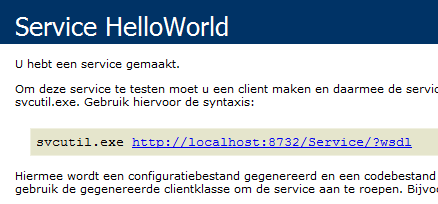
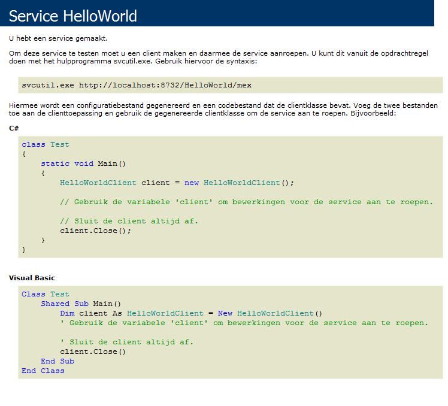
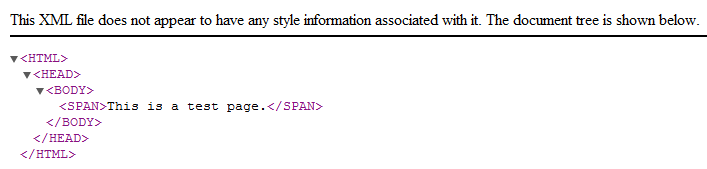
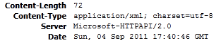
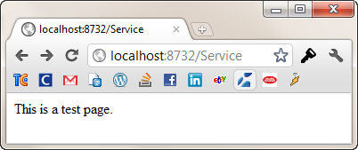
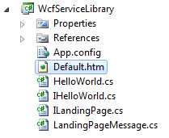
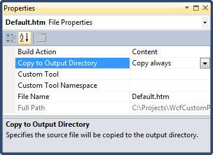
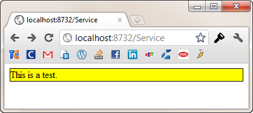

# Replacing the \"You have created a service\" message

## Introduction

You all know the default page you get when you enter a WCF service's URL in a browser (e.g. http://localhost/Service.svc). You are greeted by a blue and white (mostly white) screen that informs you that you have just created a service.



(Sorry for the Dutch localization in the screenshot.)

So apart from informing you that you have created a service (handy if you suffer from alzheimer), it also tells you where you can find the WSDL (just append ?wsdl), how to generate proxy classes and how to use these proxies.

That's all fine, but you know all of this stuff already. Besides, you don't want to display this message on public-facing services. Time to get rid of it.

## Hello, World!

Instead of the default generated landing page which is displayed when you enter the service's address in a browser I want to display a custom page. To showcase the custom page I created a simple "Hello, World!"-isch service.

```csharp
[ServiceContract]
public interface IHelloWorld
{
    [OperationContract]
    string SayHi(string name);
}
```

The service's implementation could not be any simpler.

```csharp
public class HelloWorld : IHelloWorld
{
    public string SayHi(string name)
    {
        return String.Format("Hello, {0}.", name);
    }
}
```

Let's add some configuration to the application's configuration file (Web.config / app.config).

```xml
<system.serviceModel>
  <services>
    <service name="WcfServiceLibrary.HelloWorld">
      <endpoint address="HelloWorld"
                binding="basicHttpBinding"
                contract="WcfServiceLibrary.IHelloWorld"/>
      <endpoint address="mex"
                binding="mexHttpBinding"
                contract="IMetadataExchange" />
      <host>
        <baseAddresses>
          <add baseAddress="http://localhost:8732/Service"/>
        </baseAddresses>
      </host>
    </service>
  </services>
  <behaviors>
    <serviceBehaviors>
      <behavior>
        <serviceMetadata httpGetEnabled="true"/>
        <serviceDebug includeExceptionDetailInFaults="false"/>
      </behavior>
    </serviceBehaviors>
  </behaviors>
</system.serviceModel>
```

If you navigate to the service's address (http://localhost:8732/HelloWorld/) you get the default landing page.



## Service Metadata

Let's stop exposing the metadata first. Just set the [httpGetEnabled property](http://msdn.microsoft.com/en-us/library/system.servicemodel.description.servicemetadatabehavior.httpgetenabled.aspx) of your service behavior to false.

```xml
<configuration>
  <system.serviceModel>
    <behaviors>
      <serviceBehaviors>
        <behavior name="...">
          <serviceMetadata httpGetEnabled="true" />
        </behavior>
      </serviceBehaviors>
    </behaviors>
  </system.serviceModel>
</configuration>
```

Well, that was easy. If you navigate to the address' URL now, you'll still see the same page, but this time no URL pointing to the service's WSDL. "Ha...I'll manually append '?wsdl' to the URL" you say? Try it, you'll get a blank page and nothing more. While you are it, at also remove the metadata exchange (mex) endpoint from the service.

## Unmatched Message Handler

Let's create a custom landing page. To do so, you need to create a new service contract called ILandingPage.

```csharp
[ServiceContract]
public interface ILandingPage
{
    [OperationContract(Action="*", ReplyAction="*")]
    Message Index();
}
```

This service operation handles all messages that cannot be directed to a service operation. This is done by specifying an asterisk (\*) as the value for the [Action property](http://msdn.microsoft.com/en-us/library/system.servicemodel.operationcontractattribute.action.aspx) of the [OperationContract attribute](http://msdn.microsoft.com/en-us/library/system.servicemodel.operationcontractattribute.aspx).

This is also called an unmatched message handler. One of the conditions is that it can only take a parameter of the type Message and either returns void or also an instance of the [Message type](http://msdn.microsoft.com/en-us/library/system.servicemodel.channels.message.aspx). Here we're only interested in the return message which represents the custom landing page.

The implementation for this new service contract is quite simple. Just have the service for which you want to create a custom landing page implement it.

```csharp
public class HelloWorld : IHelloWorld, ILandingPage
{
    //...

    public Message Index()
    {
        return new LandigePageMessage();
    }
}
```

Just have it return a new descendant of the Message type which represents your custom landing page. In this case I called it LandingPageMessage.

## Custom Landing Page

Time to create the custom Message descendant for the custom landing page.

```csharp
public class LandingPageMessage: Message
{
    private readonly MessageHeaders _headers;
    private readonly MessageProperties _properties;

    public LandigePageMessage()
    {
        this._headers = new MessageHeaders(MessageVersion.None);
        this._properties = new MessageProperties();
    }

    public override MessageHeaders Headers
    {
        get { return this._headers; }
    }

    public override MessageProperties Properties
    {
        get { return this._properties; }
    }

    public override MessageVersion Version
    {
        get { return this._headers.MessageVersion; }
    }

    protected override void OnWriteBodyContents(XmlDictionaryWriter writer)
    {
        writer.WriteStartElement("HTML");
        writer.WriteStartElement("HEAD");
        writer.WriteStartElement("BODY");
        writer.WriteStartElement("SPAN");
        writer.WriteString("This is a test page.");
        writer.WriteEndElement();
        writer.WriteEndElement();
        writer.WriteEndElement();
        writer.WriteEndElement();
    }
}
```

The new LandingPageMessage type implements all of the abstract members of the Message type. This is quite straightforward. Only the OnWriteBodyContents(...) method contains a bit of logic. Here you can generate some HTML output using the [XmlDictionaryWriter](http://msdn.microsoft.com/en-us/library/system.xml.xmldictionarywriter.aspx) object which is passed into this method.

Time to update the application's configuration file. First add a new endpoint to the service.

```xml
<service name="WcfServiceLibrary.HelloWorld">
  <endpoint address="HelloWorld"
            binding="basicHttpBinding"
            contract="WcfServiceLibrary.IHelloWorld"/>
  <endpoint address=""
            binding="customBinding"
            bindingConfiguration="landingPage"
            contract="WcfServiceLibrary.ILandingPage"/>
  <host>
    <baseAddresses>
      <add baseAddress="http://localhost:8732/Service"/>
    </baseAddresses>
  </host>
</service>
```

As you can see the new endpoint uses a custom binding, which is declared as follows:

```xml
<bindings>
  <customBinding>
    <binding name="landingPage">
      <textMessageEncoding messageVersion="None"/>
      <httpTransport/>
    </binding>
  </customBinding>
</bindings>
```

## Service Host

To test the "Hello, World!" service I quickly created a console application to act as the service host. Apart from an application configuration file (App.config) which contains the configuration code listed so far, it only contains the following lines of code:

```csharp
class Program
{
    static void Main()
    {
        var service = new ServiceHost(typeof (HelloWorld));
        service.Description.Behaviors.Remove<ServiceDebugBehavior>();
        service.Open();

        Console.WriteLine("Service started.");
        Console.ReadKey();
    }
}
```

The [ServiceDebugBehavior](http://msdn.microsoft.com/en-us/library/system.servicemodel.description.servicedebugbehavior.aspx) is removed from the behaviors of the service to ensure the custom page will be shown.

After you start the host application and open the service's URL (http://localhost:8732/Service) in a browser you'll get the following page instead:



## Content Type

Hrm, why is the custom landing page being treated as an XML document? Let's open the page in FireFox and see what FireBug has to tell.



The content type is "application/xml; charset=utf-8"? That's not right. Luckily this can easily be fixed using the [WebOperationContext](http://msdn.microsoft.com/en-us/library/system.servicemodel.web.weboperationcontext.aspx) helper class. Add a reference to the System.ServiceModel.Web assembly for the project which contains your service and update the implementation of ILandingPage's Index method as shown in the following code sample:

```csharp
public Message Index()
{
    var context = WebOperationContext.Current;
    context.OutgoingResponse.ContentType = "text/html";
    return new LandingPageMessage();
}
```

Restart the host application and refresh your browser. Now the landing page will be shown correctly because you specified "text/html" as the content type instead of defaulting to "application/xml".



## Further Customization

Personally I don't want to create a HTML page by building it in code using a XmlDictionaryWriter object. Notepad should be enough. So let's do just that. Open Notepad and create a simple HTML page.

For example:

```html
<html>
  <head>
    <title></title>
  </head>
  <body>
    <div style="background-color: yellow; border: 1px solid black;">
      This is a test.
    </div>
  </body>
</html>
```

Save the HTML file (e.g. Default.htm) and add it to the project which contains your WCF service.



Be sure to set its "Copy to Output Directory" property to "Copy Always".



Next its time to refactor the OnWriteBodyContents(...) method of the CustomLandingPage type. Just replace the existing code with the following lines of code:

```csharp
protected override void OnWriteBodyContents(XmlDictionaryWriter writer)
{
    var document = new HtmlDocument();
    document.Load("Default.htm");

    var bodyNode = document.DocumentNode.SelectSingleNode("//html");
    writer.WriteStartElement("HTML");
    writer.WriteRaw(bodyNode.InnerHtml);
    writer.WriteEndElement();
}
```

Here the HTML document which you created earlier is parsed and its contents are being written to the XmlDictionaryWriter object. If you restart the host application once more and visit the service's base URL in a browser you'll see that your custom HTML page will be displayed.



**Remark**: In order to parse the HTML document I used the [HTML Agility Pack](http://htmlagilitypack.codeplex.com/) which can be downloaded from CodePlex or [NuGet](http://nuget.org/List/Packages/HtmlAgilityPack).
